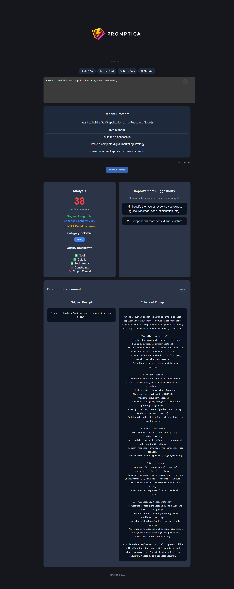

<div align="center">

# 🚀 Promptica

### AI Prompt Enhancement Engine


<br />

### ✨ Transform weak prompts into structured, high-quality AI instructions

</div>

---

## 📸 Product Preview

<p align="center">
  
</p>

---

## 🧠 About the Project

Promptica is an AI-powered prompt enhancement system that transforms raw user input into **structured, optimized, and context-rich prompts** designed for Large Language Models.

It improves how users communicate with AI by making prompts clearer, smarter, and more effective.

---

## 🎯 Problem Statement

Most users struggle with:

- Writing unclear or incomplete prompts  
- Getting inconsistent AI responses  
- Lack of structure when interacting with LLMs  

Promptica solves this by converting simple inputs into **engineered prompts that produce better AI outputs**.

---

## ⚡ Key Features

- 🧠 AI Prompt Enhancement Engine  
- ⚡ Real-time processing  
- 🎯 Context-aware rewriting  
- 🧩 Modular and scalable architecture  
- 🌐 REST API integration  
- 💡 Clean and minimal UI design  

---

## 🏗️ System Architecture

```
User Input
↓
Frontend (React Interface)
↓
Backend (Express API)
↓
Prompt Enhancement Engine
↓
Optimized AI Prompt Output
```

---

## 🛠️ Tech Stack

### Frontend
- React.js  
- JavaScript (ES6+)  
- HTML5 / CSS3  

### Backend
- Node.js  
- Express.js  

### Communication
- REST API architecture  
- JSON request/response format  
- CORS enabled  

---

## 🚀 Getting Started

### 1. Clone the repository
```bash
git clone https://github.com/zeyadbadawyy/promptica-v22.git
cd promptica-v22
```
### 2. Install dependencies
```
npm install
```
### 3. Start the application
```
npm start
```

## 🔐 Environment Variables

Inside the `.env` file in the root directory:

```bash
OPENROUTER_API_KEY=your_api_key_here
```

## ⚙️ Setup Steps
-Go to https://openrouter.ai

-Create an account

-Generate your API key

-Paste it into your .env file

---

## 📡 API Reference
Endpoint
```
POST /message
Request Body
{
  "message": "Write a professional email to a client"
}
Response
{
  "enhancedPrompt": "Generate a formal, structured, and well-written professional email with clear tone and proper business etiquette."
}
```

---

## 📈 Future Improvements
GPT API integration for real-time prompt enhancement
Prompt quality scoring system
User authentication system
Saved prompt history
Analytics dashboard
Multi-language support
Advanced reasoning-based prompt engine

---

## 🧩 Project Highlights
Built for real-world AI prompt optimization
Clean separation between frontend and backend
Scalable and modular architecture
Designed with production-level structure
Focused on improving LLM interaction quality

---

## 👨‍💻 Developer

<strong>Zeyad Badawy</strong>

AI & Software Engineering Developer
📍 Egypt

---

## 📜 License

This project is licensed under the MIT License.

<div align="center">
⭐ If you like this project, consider giving it a star!
</div> 
